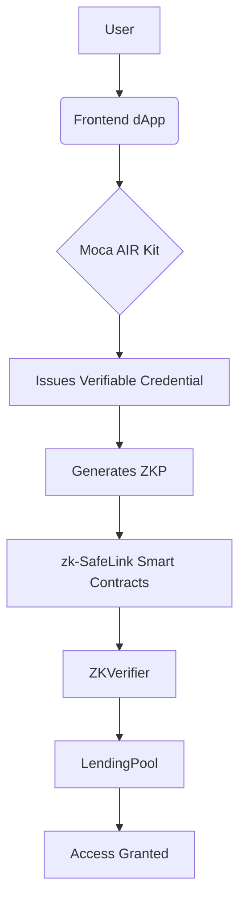

# zk-SafeLink

[](https://opensource.org/licenses/MIT)

**Privacy-Preserving, KYC-Gated DeFi for Mass Adoption.**

zk-SafeLink demonstrates how decentralized identity can unlock sophisticated DeFi primitives like under-collateralized lending without compromising user privacy. By leveraging Moca Network's AIR Kit and Zero-Knowledge Proofs, users can prove their eligibility for enhanced services without revealing any personal data.

## 📖 Table of Contents

- [Overview](#-overview)
- [Tech Stack](#-tech-stack)
- [System Architecture](#-system-architecture)
- [Installation & Setup](#-installation--setup)
- [Usage](#-usage)
- [Project Structure](#-project-structure)
- [Team](#-team)

## 🌟 Overview

This project is a proof-of-concept DeFi lending dApp with two tiers of access:
1.  **Standard Pool:** For anonymous users. Requires high collateralization (e.g., 150%).
2.  **Privileged Pool:** For verified users. Grants access to a lower collateralization ratio (e.g., 110%). Access is gated by a Zero-Knowledge Proof generated from a Moca Network Verifiable Credential.

## 🛠 Tech Stack

*   **Identity & ZKP:** Moca Network AIR Kit (Account & Credential Services)
*   **Blockchain:** Ethereum Sepolia Testnet (or other EVM-compatible chain)
*   **Smart Contracts:** Solidity, Hardhat
*   **Frontend:** Next.js, React, ethers.js, Tailwind CSS
*   **Wallet Connection:** WalletConnect/Web3Modal

## 🏗 System Architecture

The system comprises three main components:

1.  **Frontend dApp (Next.js):** The user interface for connecting wallets, managing identity, and interacting with the protocol.
2.  **Moca AIR Kit:** Handles user login, issues Verifiable Credentials, and provides the SDK for generating ZKPs.
3.  **zk-SafeLink Smart Contracts (Solidity):**
    *   `ZKVerifier.sol`: Verifies the validity of the ZKP submitted by a user.
    *   `LendingPool.sol`: Manages the lending pools and checks the user's verified status before allowing access to the privileged tier.



## 💻 Installation & Setup
Follow these steps to run the project locally.

### Prerequisites
- Node.js (v18 or later)
- npm, yarn, or pnpm
- A code editor (e.g., VS Code)
- A Web3 wallet (e.g., MetaMask)

### Steps
1. Clone the repository:
```bash
git clone https://github.com/your-username/zk-safelink.git
cd zk-safelink
```
2. Install dependencies:
```bash
# Install frontend dependencies
cd frontend
npm install

# Install smart contract dependencies
cd ../contracts
npm install
```
3. Environment Configuration:
- Copy `.env.example` to `.env` in both the `frontend` and `contracts` directories.
- Fill in your environment variables:
  - `ALCHEMY_SEPOLIA_URL` (or similar RPC endpoint)
  - `PRIVATE_KEY` (for contract deployment)
  - `MOCA_AIR_KIT_PROJECT_ID` (from your Moca Developer Dashboard)
4. Deploy Smart Contracts:
```bash
cd contracts
npx hardhat compile
npx hardhat run scripts/deploy.js --network sepolia
```
*Update the frontend's configuration with the new contract addresses.*
5. Run the Frontend Development Server:
```bash
cd frontend
npm run dev
```
The dApp will be available at `http://localhost:3000`.

## 🧪 Usage
1. Connect Your Wallet: Open the dApp and connect your Ethereum wallet (e.g., MetaMask).
2. Get Verified: Navigate to the "Get Verified" section. This will open the Moca AIR Kit flow.
  - Complete the simulated KYC and credit check forms.
  - A Verifiable Credential will be issued to your Moca Identity.
3. Generate Proof: When you attempt to access the "Privileged Lending Pool," the dApp will prompt you to generate a ZKP from your credential. This happens seamlessly in the background.
4. Access DeFi: Once the proof is verified on-chain, you can interact with the privileged pool and enjoy a lower collateralization ratio!

## 📁 Project Structure
```text
zk-safelink/
├── contracts/                 # Smart Contracts
│   ├── contracts/
│   │   ├── ZKVerifier.sol
│   │   └── LendingPool.sol
│   ├── scripts/
│   │   └── deploy.js
│   └── hardhat.config.js
├── frontend/                  # dApp Frontend
│   ├── components/
│   │   ├── Identity/
│   │   └── DeFi/
│   ├── pages/
│   ├── utils/
│   └── public/
└── README.md
```

## 👥 Team
- Gaurav Karakoti - [[@GauravKarakoti](https://t.me/GauravKarakoti)] - [[@GauravKara_Koti](https://x.com/GauravKara_Koti)]

---

Built with ❤️ for the Moca Network Hackathon.
